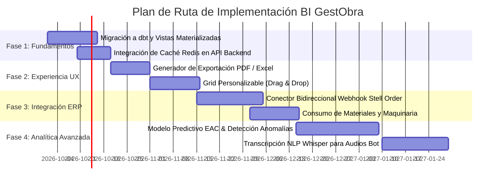

# Propuestas Estratégicas del Comité de Expertos BI & ERP - GestObra

## 📋 Resumen Ejecutivo y Composición del Comité

Este documento consolida los análisis, deliberaciones y propuestas técnicas redactadas por el **Comité Multidisciplinario de Expertos en BI, UX/UI, Estrategia de Negocio, Integración ERP e Ingeniería de Datos**. El objetivo es evolucionar el módulo de Business Intelligence de **GestObra** desde su estado actual (analítica descriptiva y dashboard en tiempo real) hacia una **plataforma analítica prescriptiva y predictiva de nivel empresarial**.

### 👥 Miembros del Comité de Expertos:
1. **Dra. Elena Valenzuela** - *Directora de UX/UI y Ergonomía Visual de Datos*.
2. **Ing. Carlos Mendoza** - *Especialista Principal en BI, Machine Learning & Analítica Avanzada*.
3. **Lic. Sofía Granados** - *Directora de Estrategia Financiera y Control de Gestión de Obras*.
4. **Ing. Roberto Álvarez** - *Arquitecto de Integración ERP (Stell Order & GestObra Core)*.
5. **Dr. Alejandro Prieto** - *Ingeniero Principal de Datos y Sistemas Distribuidos*.

---

## 🎨 1. Propuestas de UX/UI & Experiencia Visual (Dra. Elena Valenzuela)

### Proposal UX-01: Layout Personalizable por Rol (Drag & Drop Widget Grid)
*   **Problema**: Los jefes de obra, los directores financieros y los encargados de campo necesitan visualizar métricas distintas en su pantalla principal.
*   **Propuesta**: Implementar un sistema de rejilla interactiva (Gridstack.js / Dashboard Grid) que permita a cada usuario arrastrar, redimensionar y ocultar tarjetas de KPI y gráficos, guardando su configuración preferida en el perfil del usuario.
*   **Diseño de Componentes**:
    - Añadir botón `⚙️ Personalizar Dashboard` en la barra superior.
    - Modo edición con indicadores visuales de arrastre (`cursor-grab`).
    - Opción para restablecer la vista predeterminada.

### Proposal UX-02: Generador de Informes Exportables en 1-Clic (PDF / Excel / PowerPoint)
*   **Problema**: Exportar gráficos e indicadores para reuniones de junta directiva o clientes requiere capturas manuales.
*   **Propuesta**: Integrar una utilidad con `html2pdf.js` y `ExcelJS` para generar automáticamente:
    - **Reporte Ejecutivo PDF**: Documento formal con logotipo de la empresa, KPIs principales y gráficos seleccionados.
    - **Dataset Consolidado Excel**: Ficheros con pestañas dedicadas a Fichajes, Imputaciones, Sin Obra y Alertas.

### Proposal UX-03: Mapa de Calor (Heatmap) Temporal de Turnos y Fichajes
*   **Problema**: Dificultad para visualizar a qué horas del día y días de la semana se concentran los fichajes e interacciones con el bot de WhatsApp.
*   **Propuesta**: Incorporar un gráfico de mapa de calor de matriz 7x24 (Días de la semana vs Horas del día) para identificar horas pico de entrada/salida y posibles registros fuera de jornada laboral.

---

## 🔬 2. Propuestas de Analítica Avanzada & Machine Learning (Ing. Carlos Mendoza)

### Proposal BI-01: Modelo Predictivo de Desviación de Costes (Cost Overrun Forecasting)
*   **Problema**: Actualmente las desviaciones de presupuesto en obras se detectan cuando los costes ya han sido incurridos.
*   **Propuesta**: Desarrollar un modelo de regresión lineal/XGBoost que proyecte el coste final estimado al terminar la obra (*Estimate at Completion - EAC*) basándose en la velocidad de imputación de horas actual vs. el avance presupuestado.
*   **Fórmula Técnica**:
    $$\text{EAC} = \text{Coste Actual Incurrido} + \frac{\text{Presupuesto Restante}}{\text{Índice de Rendimiento de Costes (CPI)}}$$
    donde $\text{CPI} = \frac{\text{Valor Ganado}}{\text{Coste Real}}$.

### Proposal BI-02: Detección Automática de Anomalías en "Sin Obra" (Spike Detection)
*   **Problema**: El volumen actual de horas "Sin Obra" (72.6%) requiere supervisión continua para evitar abusos o desvíos.
*   **Propuesta**: Implementar un algoritmo de detección de anomalías basado en *Isolation Forest* / Z-Score modificado que genere alertas automáticas cuando un operario o cuadrilla supere en +2 desviación estándar ($> 2\sigma$) la mediana de horas "Sin Obra" del grupo.

### Proposal BI-03: Procesamiento de Lenguaje Natural (NLP) y Transcripción de Audios de WhatsApp
*   **Problema**: Los operarios envían notas de voz en campo informando de incidencias que no quedan categorizadas sintácticamente.
*   **Propuesta**: Integrar Whisper AI (u OpenAI Speech API) en el pipeline ETL para transcribir notas de voz y aplicar extracción de entidades (NER) detectando automáticamente palabras clave como `"material defectuoso"`, `"retraso proveedor"`, `"accidente"`, `"lluvia"`.

---

## 💼 3. Propuestas de Estrategia Financiera & Control de Negocio (Lic. Sofía Granados)

### Proposal BUS-01: Matriz de Rentabilidad y Margen Real por Cliente
*   **Problema**: Se analiza el volumen de horas pero no la rentabilidad efectiva por cliente tras deducir costes directos e indirectos.
*   **Propuesta**: Construir un cuadro de mando de Margen Bruto por Cliente calculando:
    $$\text{Margen Bruto (€)} = \text{Facturación al Cliente} - (\text{Coste M.O. Directa} + \text{Coste M.O. Sin Obra Proporcional})$$
    Clasificando a los clientes en cuadrantes de Matriz BCG (Estrellas, Vaca Millonaria, Perros y Preguntas).

### Proposal BUS-02: Scorecard de Recuperación de Horas No Imputadas
*   **Problema**: Las 12.216,1 h de "Sin Obra" representan 244.322,40 € en costes no facturados.
*   **Propuesta**: Implementar un plan de recuperación gradual asignando un KPI de "Tasa de Imputación Efectiva" ($\text{TIE} \ge 85\%$) para cada jefe de obra, incentivando la regularización diaria de fichajes.

---

## 🔄 4. Propuestas de Integración ERP (Ing. Roberto Álvarez)

### Proposal ERP-01: Sincronización Bidireccional en Tiempo Real con Stell Order ERP
*   **Problema**: Los datos de control horario e imputaciones de GestObra deben replicarse manualmente en Stell Order o el ERP corporativo.
*   **Propuesta**: Diseñar un conector Webhook/REST API de dos vías:
    - **GestObra -> Stell Order**: Envío automático de partes de trabajo validados para facturación.
    - **Stell Order -> GestObra**: Importación de presupuestos aprobados, tarifas de clientes y nuevas obras activadas.

### Proposal ERP-02: Conciliación de Consumo de Materiales y Maquinaria por Obra
*   **Problema**: El dashboard actual mide únicamente mano de obra, ignorando costes de materiales y alquiler de maquinaria.
*   **Propuesta**: Expandir el modelo en estrella (`fact_material_consumption`) para correlacionar las horas trabajadas por operario con los albaranes de entrega y uso de maquinaria en la misma obra.

---

## ⚙️ 5. Propuestas de Ingeniería de Datos e Infraestructura (Dr. Alejandro Prieto)

### Proposal DATA-01: Capa de Transformación con dbt (data build tool) & PostgreSQL
*   **Problema**: El procesamiento ETL actual se realiza en scripts de Python monolíticos.
*   **Propuesta**: Migrar las transformaciones analíticas a **dbt (data build tool)** ejecutando transformaciones SQL modulares, versionadas y probadas sobre el esquema `analytics` de PostgreSQL.

### Proposal DATA-02: Capa de Caché en Memoria con Redis (Sub-20ms Latency)
*   **Problema**: Con miles de peticiones simultáneas, las consultas directas a PostgreSQL podrían degradar el rendimiento.
*   **Propuesta**: Incorporar un contenedor de caché Redis con invención de claves por hash de parámetros (`cache_key = md5(client + project + person + exclude_dev)`), con un tiempo de vida (TTL) de 5 minutos.

```python
# Ejemplo de decorador Redis Cache para Flask API
import redis
import json
import hashlib

r = redis.Redis(host='localhost', port=6379, db=0)

def cache_response(ttl_seconds=300):
    def decorator(f):
        def wrapper(*args, **kwargs):
            cache_key = hashlib.md5(request.full_path.encode('utf-8')).hexdigest()
            cached = r.get(cache_key)
            if cached:
                return json.loads(cached)
            result = f(*args, **kwargs)
            r.setex(cache_key, ttl_seconds, json.dumps(result))
            return result
        return wrapper
    return decorator
```

### Proposal DATA-03: Framework de Validación de Calidad de Datos (Great Expectations)
*   **Problema**: Si la base de datos de producción introduce registros corruptos (ej. fichajes con duración negativa o fechas futuras), los gráficos pueden fallar.
*   **Propuesta**: Integrar suite de pruebas automáticas con Great Expectations en el pipeline de datos para detener la ingesta si se detectan anomalías graves.

---

## 🚀 Plan de Ruta para Implementación (Roadmap)



---

## 💡 Conclusión y Próximos Pasos

El plan diseñado por el comité de expertos posiciona a **GestObra BI** como una herramienta integral no solo para la auditoría y control de costes en tiempo real, sino como un activo estratégico predictivo capaz de anticipar desviaciones de presupuesto, recuperar costes de horas no imputadas y automatizar el flujo de trabajo operacional con el ERP de la compañía.
