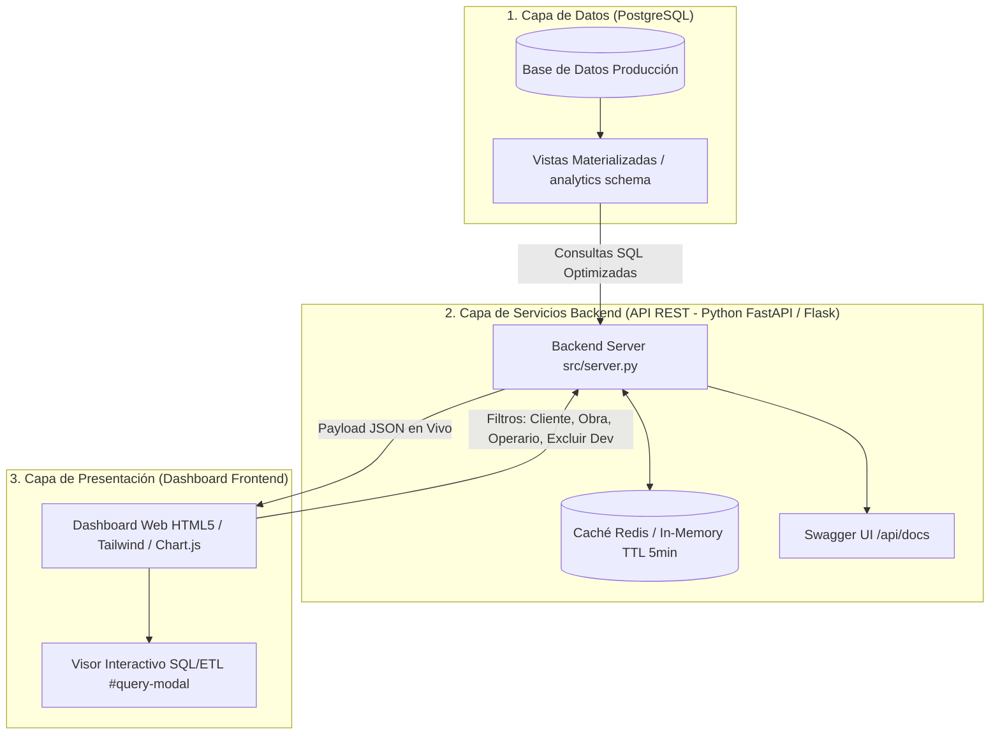

# Guía de Integración en Servidor (Consultas en Vivo) - GestObra BI

Este documento detalla la arquitectura de producción, las especificaciones de la API REST, el esquema de datos y las consultas SQL necesarias para desplegar e integrar el sistema de **Business Intelligence (BI) de GestObra** en un entorno de producción con consultas en tiempo real directamente sobre PostgreSQL.

---

## 1. Arquitectura de Producción (Consultas en Tiempo Real)

Para sustituir el almacenamiento local en memoria (CSVs) por una solución empresarial en producción, el sistema adopta una arquitectura desacoplada de 3 capas:



---

## 2. Especificación de Endpoints de la API REST

El backend (`src/server.py` o backend FastAPI equivalente) expone los siguientes endpoints para alimentar el dashboard en vivo:

### A. Core Metrics & Payload Monolítico
*   `GET /api/data`: Payload completo consolidado para carga inicial y refresco dinámico.
    *   **Parámetros Query**:
        *   `client` (string, opcional): Nombre del cliente.
        *   `project` (string, opcional): Nombre de la obra.
        *   `person` (string, opcional): Nombre del operario.
        *   `exclude_dev` (boolean, opcional, por defecto `false`): Si es `true`, excluye `Gestobra Dev Team` y `Gestobra`.

### B. Endpoints de Agregación Específicos
*   `GET /api/clients`: Lista de clientes únicos con obras activas.
*   `GET /api/projects?client=X`: Proyectos asociados al cliente indicado.
*   `GET /api/people`: Listado de operarios y sus tarifas horarias.
*   `GET /api/aggregations/client`: Totales de horas, costes de M.O. y conteo de obras por cliente.
*   `GET /api/aggregations/person`: Horas trabajadas, imputaciones y actividad de WhatsApp por operario.
*   `GET /api/aggregations/project`: Rendimiento y costes acumulados por obra.
*   `GET /api/sin-obra/metrics`: KPIs y desglose específico de horas no asignadas a obra ("Sin Obra").
*   `GET /api/messaging/breakdown`: Clasificación de mensajes de WhatsApp (`Bot_Automatico` vs `Llamada_Manual`, `Nota_Voz_Manual`, `Multimedia_Manual`, `Texto_Manual`).
*   `GET /api/queries/<chart_id>`: Devuelve los metadatos de consulta SQL, script Pandas ETL y descripción del gráfico especificado.

---

## 3. Consultas SQL Optimizadas para Producción

### 1. KPIs Globales de Control Horario e Imputación
```sql
SELECT 
    COUNT(DISTINCT pi.project_id) AS total_projects,
    COALESCE(SUM(tc.hours_worked), 0) AS total_hours_clocked,
    COALESCE(SUM(pi.hours_imputed), 0) AS total_hours_imputed,
    COALESCE(SUM(pi.calculated_cost), 0) AS total_labor_cost,
    (SELECT COUNT(*) FROM analytics.fact_messages) AS total_messages
FROM analytics.fact_project_imputation pi
JOIN analytics.dim_project dp ON pi.project_id = dp.project_id
JOIN analytics.dim_person dpe ON pi.person_id = dpe.person_id
LEFT JOIN analytics.fact_time_clock tc ON pi.date = tc.work_date AND pi.person_id = tc.person_id
WHERE 
    (:client_name IS NULL OR dp.client_name = :client_name)
    AND (:project_name IS NULL OR dp.name = :project_name)
    AND (:person_name IS NULL OR dpe.person_name = :person_name)
    AND (:exclude_dev = FALSE OR dp.client_name NOT IN ('Gestobra Dev Team', 'Gestobra'));
```

### 2. Módulo "Sin Obra" (Horas Fichadas Sin Proyecto Asignado)
```sql
SELECT 
    dpe.person_name,
    dp.client_name,
    SUM(dc.project_hours_worked) AS sin_obra_hours,
    ROUND(SUM(dc.project_hours_worked) * 20.0, 2) AS estimated_cost
FROM analytics.distributed_clock dc
JOIN analytics.dim_person dpe ON dc.person_id = dpe.person_id
JOIN analytics.dim_project dp ON dc.project_id = dp.project_id
WHERE 
    dc.project_name = 'Sin Obra'
    AND (:client_name IS NULL OR dp.client_name = :client_name)
    AND (:exclude_dev = FALSE OR dp.client_name NOT IN ('Gestobra Dev Team', 'Gestobra'))
GROUP BY dpe.person_name, dp.client_name
ORDER BY sin_obra_hours DESC;
```

### 3. Clasificación de Mensajes WhatsApp (Bot Automático vs Manuales)
```sql
SELECT 
    CASE 
        WHEN LOWER(direction) IN ('outgoing', 'outbound') THEN 'Bot_Automatico'
        WHEN LOWER(type) = 'call' THEN 'Llamada_Manual'
        WHEN LOWER(type) = 'audio' THEN 'Nota_Voz_Manual'
        WHEN LOWER(type) IN ('image', 'video', 'document') THEN 'Multimedia_Manual'
        ELSE 'Texto_Manual'
    END AS category,
    COUNT(*) AS total_messages,
    ROUND(COUNT(*) * 100.0 / SUM(COUNT(*)) OVER(), 1) AS percentage
FROM analytics.fact_messages
GROUP BY category
ORDER BY total_messages DESC;
```

### 4. Desglose de Mensajes Automáticos vs Manuales por Cliente
```sql
SELECT 
    client_name,
    COUNT(CASE WHEN is_automated = TRUE THEN 1 END) AS auto_messages,
    COUNT(CASE WHEN is_automated = FALSE THEN 1 END) AS manual_messages,
    COUNT(*) AS total_messages
FROM analytics.fact_messages
WHERE (:exclude_dev = FALSE OR client_name NOT IN ('Gestobra Dev Team', 'Gestobra'))
GROUP BY client_name
ORDER BY total_messages DESC;
```

### 5. Alertas Diarias de Discrepancia (> 30 min entre Fichado e Imputado)
```sql
WITH daily_compare AS (
    SELECT 
        COALESCE(tc.work_date, pi.date) AS work_date,
        COALESCE(tc.person_id, pi.person_id) AS person_id,
        COALESCE(SUM(tc.hours_worked), 0) AS hours_clocked,
        COALESCE(SUM(pi.hours_imputed), 0) AS hours_imputed
    FROM analytics.fact_time_clock tc
    FULL OUTER JOIN analytics.fact_project_imputation pi 
        ON tc.work_date = pi.date AND tc.person_id = pi.person_id
    GROUP BY COALESCE(tc.work_date, pi.date), COALESCE(tc.person_id, pi.person_id)
)
SELECT 
    dc.work_date,
    dp.person_name,
    dc.hours_clocked,
    dc.hours_imputed,
    ROUND(dc.hours_clocked - dc.hours_imputed, 2) AS difference
FROM daily_compare dc
JOIN analytics.dim_person dp ON dc.person_id = dp.person_id
WHERE 
    ABS(dc.hours_clocked - dc.hours_imputed) > 0.5
ORDER BY dc.work_date DESC, dp.person_name ASC
LIMIT 100;
```

---

## 4. Estrategia de Rendimiento e Indexación en PostgreSQL

Para garantizar respuestas en vivo por debajo de los 100 ms, se deben aplicar los siguientes índices en la base de datos de producción:

```sql
-- Índices para acelerar joins y filtros de fechas y organizaciones
CREATE INDEX IF NOT EXISTS idx_fact_imputation_date_project ON analytics.fact_project_imputation(date, project_id, person_id);
CREATE INDEX IF NOT EXISTS idx_fact_clock_date_person ON analytics.fact_time_clock(work_date, person_id);
CREATE INDEX IF NOT EXISTS idx_fact_messages_client_auto ON analytics.fact_messages(client_name, is_automated);
CREATE INDEX IF NOT EXISTS idx_distributed_clock_project_client ON analytics.distributed_clock(project_name, client_name);

-- Vista materializada de resumen de clientes
CREATE MATERIALIZED VIEW IF NOT EXISTS analytics.mv_client_summary AS
SELECT 
    client_name,
    COUNT(DISTINCT project_id) AS total_projects,
    SUM(hours_imputed) AS total_hours,
    SUM(calculated_cost) AS total_cost
FROM analytics.fact_project_imputation pi
JOIN analytics.dim_project dp ON pi.project_id = dp.project_id
GROUP BY client_name;

-- Refresco programado (ej. medianoche con pg_cron)
-- SELECT cron.schedule('0 0 * * *', 'REFRESH MATERIALIZED VIEW CONCURRENTLY analytics.mv_client_summary');
```

---

## 5. Integración en el Frontend (`output/dashboard_live.html`)

El dashboard web en vivo utiliza la siguiente lógica asíncrona para consultar los endpoints REST y refrescar dinámicamente los 17 gráficos sin recargar la página:

```javascript
// Función para refrescar el dashboard en vivo desde el backend API
async function refreshLiveDashboard() {
    const client = document.getElementById('filter-client').value;
    const project = document.getElementById('filter-project').value;
    const person = document.getElementById('filter-person').value;
    const excludeDev = document.getElementById('btn-toggle-dev').classList.contains('active');

    const params = new URLSearchParams({
        client: client,
        project: project,
        person: person,
        exclude_dev: excludeDev
    });

    try {
        const response = await fetch(`/api/data?${params.toString()}`);
        const data = await response.json();

        // Actualizar KPIs
        document.getElementById('kpi-projects').innerText = data.kpis.total_projects;
        document.getElementById('kpi-hours-clocked').innerText = data.kpis.total_hours_clocked.toLocaleString('es-ES') + ' h';
        document.getElementById('kpi-labor-cost').innerText = data.kpis.total_labor_cost.toLocaleString('es-ES') + ' €';

        // Actualizar datos de gráficos de Chart.js
        updateChartData(projectChartInstance, data.charts.project_chart);
        updateChartData(clientAutoVsManualChartInstance, data.charts.client_auto_manual_chart);
        // ... actualización del resto de los 17 gráficos
    } catch (err) {
        console.error('Error al actualizar el dashboard en vivo:', err);
    }
}
```
