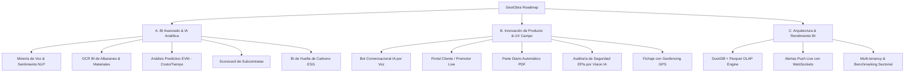

# GestObra: Análisis de Producto y Nuevas Propuestas Estratégicas

## 1. Resumen Ejecutivo y Entendimiento de GestObra

Tras investigar tanto el ecosistema de mercado de **GestObra** (en la web) como la estructura técnica de este repositorio:

*   **¿Qué es GestObra en el mercado?**
    GestObra es una plataforma especializada en la gestión de proyectos de construcción y obras (reformas, edificación, obra civil). Su ventaja competitiva diferencial es la **adopción sin fricción en campo mediante WhatsApp**. Los operarios en obra no necesitan instalar ni aprender aplicaciones complejas; realizan el **fichaje horario**, envían **partes de trabajo por nota de voz**, suben **fotos de albaranes/facturas** y consultan sus tareas directamente interactuando con un bot de WhatsApp.
*   **¿Qué es este repositorio `gestobra`?**
    Este repositorio contiene el **Módulo de Business Intelligence (BI) y Analítica** de GestObra. Procesa los datos operacionales de PostgreSQL (fichajes, partes de horas, costes, logs del bot de WhatsApp, transcripciones de voz, archivos multimedia, vehículos, tareas) mediante un modelo en estrella (Data Warehouse local / en vivo) y expone una API REST (Flask + OpenAPI Swagger) conectada a dashboards ejecutivos e interactivos.

---

## 2. Nuevas Propuestas Estratégicas y Técnicas para GestObra

A continuación se presentan **13 nuevas propuestas** diseñadas para llevar a GestObra al siguiente nivel en el mercado, divididas en 3 ejes clave:

---

### 💡 Eje A: Módulo Analítico & BI de Próxima Generación (Advanced BI & AI Analytics)

#### 1. Minería Inteligente de Audios y Clasificación de Riesgos (NLP Audio Mining)
*   **Problema / Oportunidad**: Actualmente el bot transcribe las notas de voz de WhatsApp (`voice_inputs`), pero el texto solo se guarda de forma pasiva.
*   **Propuesta**: Implementar un pipeline analítico NLP (usando modelos de clasificación de texto / LLM) que procese las transcripciones diarias e identifique automáticamente:
    *   *Categorías de incidencias*: Falta de material, avería de maquinaria, imprevisto estructural, riesgo de retraso.
    *   *Matriz de Riesgo en Vivo*: Generar en el BI un indicador de "Clima / Salud de la Obra" basado en el análisis de sentimiento y alertas verbales reportadas por los operarios.

#### 2. OCR e Inteligencia de Costos de Materiales (Albaranes & Invoices BI)
*   **Problema / Oportunidad**: Los operarios envían fotos de albaranes de entrega o tickets de compras menores por WhatsApp (`whatsapp_media_inputs`).
*   **Propuesta**: Incorporar un motor de OCR (Visión + LLM Extractor) que extraiga proveedor, NIF, artículos, cantidades e importes.
*   **Impacto BI**: Crear la tabla de hechos `fact_material_cost` para complementar `fact_project_imputation` (mano de obra). Esto ofrecerá por primera vez el **Costo Real Total de Obra en Tiempo Real** (Mano de Obra + Materiales + Maquinaria).

#### 3. Análisis Predictivo de Costos y Plazos (Earned Value Management - EVM)
*   **Problema / Oportunidad**: Los dashboards actuales muestran histórico acumulado pero no predicen el resultado final.
*   **Propuesta**: Implementar indicadores estándar de EVM:
    *   **SPI (Schedule Performance Index)**: Índice de rendimiento del cronograma ($SPI = \frac{EV}{PV}$).
    *   **CPI (Cost Performance Index)**: Índice de rendimiento de costos ($CPI = \frac{EV}{AC}$).
    *   **Forecast (EAC)**: Algoritmo de proyección temporal que calcule el costo final estimado a la conclusión de la obra y alertará con semanas de antelación sobre desviaciones del presupuesto original.

#### 4. Scorecard y Matriz de Evaluación de Subcontratas
*   **Problema / Oportunidad**: Las obras dependen fuertemente de industriales y subcontratistas externos.
*   **Propuesta**: Crear un cuadro de mando específico para evaluar y clasificar subcontratas según:
    *   Porcentaje de tareas entregadas en fecha vs retrasadas.
    *   Tasa de aprobación de trabajos al primer intento (`teams.require_task_approval`).
    *   Puntualidad en los fichajes y nivel de reporte de evidencias fotográficas.

#### 5. BI de Huella de Carbono y Eficiencia Energética de Flota (ESG)
*   **Problema / Oportunidad**: Las licitaciones de construcción y los promotores exigen cada vez más métricas de sostenibilidad (ESG / BREEAM / LEED).
*   **Propuesta**: Cruzar el uso de vehículos (`vehicles`) y horas de maquinaria registradas por proyecto para calcular la huella de carbono estimada ($tCO_2e$) por obra, permitiendo a las empresas presentar informes medioambientales para licitaciones públicas.

---

### 🚀 Eje B: Innovación de Producto y Experiencia de Usuario (Product Roadmap)

#### 6. Bot Conversacional Activo por Voz en WhatsApp (Conversational AI Action Bot)
*   **Propuesta**: Evolucionar el bot de WhatsApp de un receptor pasivo a un asistente conversacional inteligente. Un operario podrá enviar un audio como:
    > *"Hola, hoy he estado 4 horas en la Obra Centro terminando el alicatado y he usado 2 sacos de mortero."*
*   **Funcionamiento**: La IA analizará la voz, extraerá la intención y responderá por WhatsApp confirmando: *"Entendido Juan. He registrado 4h en Obra Centro (Alicatado) y consumido 2 sacos de mortero. ¿Deseas adjuntar foto?"*.

#### 7. Portal Interactivo en Tiempo Real para Clientes / Promotores (Client Portal Live)
*   **Propuesta**: Módulo de vista externa con marca blanca para clientes de la constructora. Permite visualizar:
    *   Avance físico de la obra (%) por hitos.
    *   Galería diaria de fotos de avance (filtradas automáticamente por la IA).
    *   Validación y firma de modificaciones de proyecto o presupuestos adicionales online.

#### 8. Generación Automática del Parte Diario de Obra (Libro de Órdenes Automatizado)
*   **Propuesta**: Generación automática diaria (ej. a las 19:00 h) de un documento PDF oficial por obra ("Parte Diario de Trabajo") que consolide:
    *   Lista de personal asistente (extraído de `time_clock_records`).
    *   Resumen de trabajos ejecutados y fotos clave subidas por WhatsApp.
    *   Datos meteorológicos históricos del día (vía API AEMET / OpenWeather) para justificar posibles paradas por lluvia/viento.

#### 9. Auditoría Automática de Seguridad Laboral mediante Visión por Computador (PPE Audit)
*   **Propuesta**: Analizar mediante IA de Visión por Computador todas las fotografías subidas por WhatsApp a los proyectos. El sistema escaneará la presencia de Equipos de Protección Individual (casco, chaleco reflectante, calzado de seguridad, arnés) y alertará al responsable de PRL si detecta incumplimientos en la obra.

#### 10. Fichaje con Geofencing y Validación Geográfica por GPS
*   **Propuesta**: Al realizar el fichaje por WhatsApp, el bot puede solicitar la ubicación actual ("Enviar ubicación actual"). El sistema validará automáticamente si las coordenadas GPS están dentro del polígono delimitado de la obra, marcando el fichaje como "Validado Geográfica" o "Fuera de Rango".

---

### 🛠️ Eje C: Arquitectura Técnica y Optimización BI (Engineering Enhancements)

#### 11. Motor OLAP Ultra-Rápido con DuckDB / Parquet (Reemplazo de Pandas CSV)
*   **Problema / Oportunidad**: Pandas lee archivos CSV completos en memoria en cada ejecución. A medida que la tabla de fichajes (`whatsapp_action_log` tiene ya >27.000 filas) crezca, aumentará la latencia.
*   **Propuesta**: Reemplazar la persistencia CSV en `data/` por un motor **DuckDB** o archivos en formato **Parquet**. DuckDB permite ejecutar consultas SQL vectorizadas directamente sobre archivos compressed Parquet a velocidad submilisegundo y con uso mínimo de RAM.

#### 12. Alertas y Notificaciones Push en Tiempo Real (WebSockets / SSE)
*   **Problema / Oportunidad**: El servidor backend Flask (`src/server.py`) responde actualmente a peticiones HTTP Polling tradicionales.
*   **Propuesta**: Incorporar WebSockets o Server-Sent Events (SSE) en `src/server.py` para empujar eventos en tiempo real al Dashboard (ej. al detectar un fichaje inconcluso, un error en el webhook de WhatsApp o una nota de voz de emergencia).

#### 13. Arquitectura Multi-tenant y Benchmarking Anónimo del Sector
*   **Propuesta**: Incorporar soporte nativo multi-empresa (`company_id`) en las tablas analíticas del BI. Esto habilitará una función SaaS de **Benchmarking Anónimo**: las empresas podrán comparar sus ratios de productividad (coste por $m^2$, horas por tipo de tarea, tasa de ausentismo) contra el promedio anónimo de la industria en la plataforma GestObra.

---

## 3. Plan de Implementación Recomendado

| Fase | Duración Estimada | Entregables Clave |
| --- | --- | --- |
| **Fase 1: Quick Wins BI (Materiales & OCR)** | 2 - 3 semanas | Integración de OCR para albaranes por WhatsApp + Tabla `fact_material_cost` + KPIs de Costo Total en `src/dashboard.py` y `src/server.py`. |
| **Fase 2: Motor OLAP & Alertas Push** | 2 semanas | Migración del almacenamiento local de CSV a DuckDB/Parquet + WebSockets para alertas en vivo en el Dashboard. |
| **Fase 3: Asistente IA Conversacional en WhatsApp** | 3 - 4 semanas | Integración de agente LLM para estructuración automática de partes de voz e imputaciones directas. |
| **Fase 4: Portal Cliente & Parte Diario PDF** | 3 semanas | Vista externa para promotores + motor de generación de reportes diarios en PDF con integración meteorológica. |

---
*Documento generado para el módulo de BI de GestObra.*
